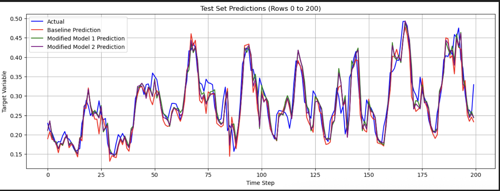

# Air Quality Forecasting with LSTM

## Summary
This project uses a multivariate time series model to forecast air quality (Ambient Temnperature). The model is built using TensorFlow/Keras trained on historical air quality, and saved as a .keras file after identifying best performing epoch using ModelCheckpoint.

## Problem
1. Forecast future ambient temperature (AT) by learning patterns from multiple historical time series features
2. Build a robust deep learning model that can handle missing and complex data

## Methodology
1. EDA & Preprocessing (Formating Date, Handling Missing Values & Anomlies (Negative Values by Cliping), Scaling, Windowing for learning short-term patterns)
3. Imputation (KNNImputer)
4. Scaling & Sequencing
5. Modeling
6. Evaluation

## Skills
1. Python: Pandas, Numpy, Matplotlib/Seaborn
2. Scikit-learn: KNN Imputer, MinMaxScaler (feature scaling), and metrics
3. Deep Learning Frameworks: Tensorflow & Keras, LSTM, Bidirectional, ModelCheckpoint, EarlyStopping

## Results 

1. The final LSTM model (modified model 2) perfomed effictively with R2 score of 0.9540
2. The model's sMAPE was 9.82% on the test set, indicating a high level of accuracy
   
## Next Steps
1. Hyperparameter tuning using tools like KerasTuner to find the optimal set of hyperparameters
2. Feature Engineering experiment with creating new features
